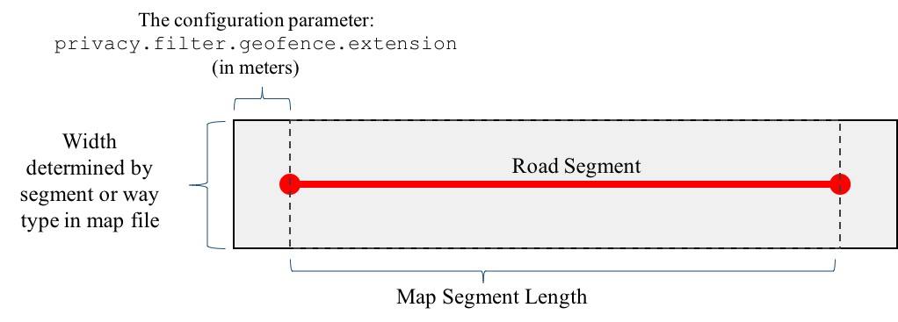

# PPM Operation

The messages suppressed and sanitized by the PPM are documented [here](https://github.com/usdot-jpo-ode/jpo-ode/blob/develop/docs/metadata_standards.md).

The PPM suppresses BSMs and TIMs message and redacts BSM ID fields based on several conditions. These conditions are determined by a set of configuration parameters. The following conditions will result in a message being suppressed, or deleted, from the stream.

1. Message JSON record cannot be parsed.
2. Message speed is outside of prescribed limits.
3. Message location is outside of a prescribed geofence.
4. BSM TemporaryID can be redacted (rendered indistinct).

## PPM Command Line Options

The PPM can be started by specifying only the configuration file. Command line options are also available. **Command
line options override parameters specified in the configuration file.** The following command line options are available:

```bash
-h | --help : print out all the command line options.
-e | --elog : Error log file name.
-i | --ilog : Information log file name.
-R | --log-rm : Remove specified/default log files if they exist.
-D | --log-dir : Directory for the log files.
-v | --log-level : The info log level [trace,debug,info,warning,error,critical,off]
-t | --produce-topic : the name of the topic where filtered messages are published.
-p | --partition : the partition from which to consume raw messages.
-C | --config-check : Check whether the configuration will work and output all the settings.
-o | --offset : the byte offset in the consumer partition from which to start reading.
-d | --debug : the debug level (TBD)
-c | --config : the path to the configuration file.
-g | --group : Consumer group identifier
-b | --broker : Broker address
-x | --exit : tell the PPM to exist when the last message in the partition is read.
-m | --mapfile : The path to the map file to use to build the geofence.
```

# PPM Deployment

Once the PPM is [installed and configured](installation.md) it operates as a background service.  The PPM can be started
before or after other services. If started before the other services, it may produce some error messages while it waits
to connect.  The following command will start the service using only the configuration file:

```
$ ./ppm -c <configuration file>
```

We recommend reviewing the [testing documentation](testing.md) for more details on running the PPM.

# PPM Kafka Limitations

With regard to the Apache Kafka architecture, each PPM process does **not** provide a way to take advantage of Kafka's scalable
architecture. In other words, each PPM process will consume data from a single Kafka topic and a single partition within
that topic. One way to consume topics with multiple partitions is to launch one PPM process for each partition; the
configuration file will allow you to designate the partition. In the future, the PPM may be updated to automatically
handle multiple partitions within a single topic.

# Multiple PPM Instances with Different Configurations

Nothing prevents a users from launching multiple PPM instances where each uses a different configuration file. This
strategy would allow various degrees of privacy protection. It would also allow a user to publish various versions of
the data to different "filtered" topics.

# PPM Logging

PPM operations are logged to two files: an information log and an error log.  The files are rotating log files, i.e., a set number of log files will
be used to record the PPM's information. By default, these files are located in a `logs` directory from where the PPM is launched and the files are
named `log.info` and `log.error`. The maximum size of a `log.info` files is 5MB and 5 files are rotated. The maximum size of a `log.error` file is 2MB
and 2 files are rotated. Logging configuration is controlled through the command line, not through the configuration file. The following operation are available:

- `-R` : When the PPM starts remove any log files having either the default or user specified names; otherwise, new log entries will be appended to existing files.

- `-D` : The directory where the log files should be written. This can be relative or absolute. If the directory does not exist, it will be created.

- `-e` : The error log file's name.

- `-i` : The information log file's name.

- `-v` : The minimum level of message to write to the information log. From lowest to highest, the message levels are `off`, `trace`, `debug`, `info`,
         `warning`, `error`, `critical`. As an example, if you specify `info` then all messages that are `info, warning, error, or critical` will be written to
         the log.

The information log will write the configuration it will use as `info` messages when it starts. The information log also record the disposition of the
messagess it receives. In the example below, the first BSM was retained, or passed on; the second message was suppressed because the vehicle's velocity
was outside of the thresholds. The information in the parenthesis is the ID, secMark, lat, lon, speed from the BSM. All log messages are preceeded
with a date and time stamp and the level of the log message.

```
[170613 12:25:47.443131] [info] BSM [RETAINED]: (ON-VG-99,36711,41.116496,-104.888494,5.000000)
[170613 12:25:47.443150] [info] BSM [SUPPRESSED-speed]: (ON-VBL--,36712,41.116496,-104.888494,1.000000)
```

# PPM Configuration

The PPM configuration file is a text file with a specific format. It can be used to configure Kafka as well as the PPM.
Comments can be added to the configuration file by starting a line with the '#' character. Configuration lines consist
of two strings separated by a '=' character; lines are terminated by newlines. The names of configuration files can be
anything; extensions do not matter.

The following is an example of a portion of a configuration file:

    # Configuration details for privacy ID redaction.
    privacy.redaction.id=ON
    privacy.redaction.id.value=FFFFFFFF
    privacy.redaction.id.inclusions=ON
    privacy.redaction.id.included=BEA10000,BEA10001

Example configuration files can be found in the [jpo-cvdp/config](../config) directory, e.g., [example.properties](../config/example.properties) is an example of a complete configuration file.

The details of the settings and how they affect the function of the PPM follow:

## Sanitization Flag

The current JSON data object sent to the PPM and published by the PPM contains the following three named components:
parts:

- `metadata`
- `payload`
- `schemaVersion`

The PPM uses the `metadata:payloadType` to determine the message type, and it modifies the `metadata:sanitized` portion 
if the message is published. The `metadata:sanitized` element is changed to `true` if the PPM publishes the message. In other words, 
all messages published by the PPM should have a `metadata:sanitized` value of `true`.

The `payload` component of the BSM has a `data` object containing the `coreData` object that is analyzed by the PPM 
for features that may cause it to be suppressed. The same analysis is done on the `receivedDetails:loction` object in the TIMS
`metadata` component. Note that the `payload` for TIMS is not inspected.

The JSON format published by the PPM follows the format received. It may be completely suppressed or certain fields may
be modifed as described in this second and the sections that follow.

## Velocity Filtering

- `privacy.filter.velocity` : enables or disables message filtering based on the speed within the message.
    - `ON` : enables message filtering.
    - Any other value : disables message filtering.

- `privacy.filter.velocity.min` : *When velocity fitering is enabled*, messages having velocities below this value will be
  suppressed. The units are in meters per second.

- `privacy.filter.velocity.max` : *When velocity fitering is enabled*, messages having velocities above this value will be
  suppressed. The units are in meters per second.

## BSM Identifier Redaction

If required, the `TemporaryID` field in the BSM can be redacted and replaced with a randomly chosen identifier. The following configuration parameters
control identifier redaction.

- `privacy.redaction.id` : enables or disables the PPM's redaction function for the BSM `id` field (`TemporaryID` field in J2735).
    - `ON` : enables redaction
    - Any other value : disables redaction.

- `privacy.redaction.id.inclusions` : *If redaction is enabled*, this parameter enables or disables the ability to specify
   **which** identifier values should be redacted.
    - `ON` : enables use of a redaction *inclusion* set. The values in the set are defined in
      the `privacy.redaction.id.included` configuration parameter.
    - Any other value : **causes all identifiers to be redacted.** Ignores the inclusion set.

- `privacy.redaction.id.included` : *If redaction and redaction inclusions are enabled*, the parameter is the list of BSM
   identifiers (right now TemporaryID) that **will be redacted**; BSMs having identifiers that are not in this set will remain in
   the BSM output by the PPM if retained.
    - Similar to the `privacy.redaction.id.value`, these are 4 hexadecimal-encoded bytes.
    - More than one id can be specified by separating them by commas.

## BSM Vehicle Size Redaction

If required, the `VehicleLength` and `VehicleWidth` fields in the BSM can be redacted and replaced with a **0** value. The following configuration parameters
control vehicle size redaction.

- `privacy.redaction.size` : enables or disables the PPM's redaction function for the BSM `size` fields `length` and `width` (`VehicleLength` and `VehicleWidth` field in J2735).
    - `ON` : enables redaction
    - Any other value : disables redaction.

## Geofencing

Messages can be suppressed based on latitude and longitude attributes. If this 
capability is turned one through the configuration file, each edge defined in the 
map file is used to infer a *component* geofence that surrounds that segment of the
road. The image below illustrates how a *rectange* is drawn to form the segment's 
geofence.  The aforementioned edge attributes and PPM configuration parameters 
determine the size of the rectange.



- `privacy.filter.geofence` : enables or disables geofence-based filtering.
    - `ON` : enables the geofence.
    - Any other value : disables geofence filtering.

- `privacy.filter.geofence.mapfile` : *If geofence filtering is enabled*, specifies the absolute or relative path and filename of a file that contains the
  map information needed to define the geofence.

- `privacy.filter.geofence.extension` : *If geofence filtering is enabled*, this is one
  of the controls that determines the size of the component geofences that
  surround road segments. See the [Map Files](#geofencing) section.

### Geofence Region Boundaries

Geofence Boundary Configuration Parameters: The geofence is stored in a geographically-defined data structured called
a quadtree. The following bounding box coordinates define the quadtree's region. The data that is stored in this data
structure is limited to those segments provided in the mapfile, e.g., `privacy.filter.geofence.mapfile`. As an example
of this relationship, the coordinates specified below could bound the entire state of Wyoming; however, only the
segments for the I-80 corridor would be stored within a quadtree covering Wyoming and used to define the geofence. One
the other hand, these coordinates can be used to **further restrict** which segments are used to define the geofence
instead of having to modify the mapfile.

- `privacy.filter.geofence.sw.lat` : The latitude of the lower-left corner of the quadtree region.
- `privacy.filter.geofence.sw.lon` : The longitude of the lower-left corner of the quadtree region.
- `privacy.filter.geofence.ne.lat` : The latitude of the upper-right corner of the quadtree region.
- `privacy.filter.geofence.ne.lon` : The longitude of the upper-right corner of the quadtree region.

## ODE Kafka Interface

- `privacy.topic.producer` : The Kafka topic name where the PPM will write the filtered messages. **The name is case
  sensitive.**

- `privacy.topic.consumer` : The Kafka topic name used by the Operational Data Environment (or other message JSON producer) that will be
  consumed by the PPM. The source of the data stream to be filtered by the PPM. **The name is case sensitive.**

- `privacy.consumer.timeout.ms` : The amount of time the consumer blocks (or waits) for a new message. If a message is
  received before this time has elapsed it will be processed immediately.

- `group.id` : The group identifier for the PPM consumer.  Consumers label
  themselves with a consumer group name, and each record published to a topic is
  delivered to one consumer instance within each subscribing consumer group.
  Consumer instances can be in separate processes or on separate machines.  **Due to the way the kafka library 
  internally updates its topic offsets, the group ID must be unique for each the topic.**

- `privacy.kafka.partition` : The partition(s) that this PPM will consume records from. A Kafka topic can be divided,
  or partitioned, into several "parallel" streams. A topic may have many partitions so it can handle an arbitrary
  amount of data.

- `metadata.broker.list` : This is the IP address of the Kafka topic broker leader.

- `compression.type` : The type of compression to use for writing to Kafka topics. Currently, this should be set to none.

# Map Files

The map file is used to define the geofence. It defines a set of shapes, one
per line. For road geofence use, the edge shape is used. The map file for the
I-80 WYDOT corridor is located in the [jpo-cvdp/data](../data) directory; it is named: `I_80.edges`

The following is a small portion of the `I_80.edges` file:

```bash
type,id,geography,attributes
edge,0,0;41.24789403;-111.0467118:1;41.24746145;-111.0455124,way_type=user_defined:way_id=80
edge,1,1;41.24746145;-111.0455124:2;41.24733395;-111.0451337,way_type=user_defined:way_id=80
edge,2,2;41.24733395;-111.0451337:3;41.24726205;-111.044904,way_type=user_defined:way_id=80
edge,3,3;41.24726205;-111.044904:4;41.24713975;-111.0444827,way_type=user_defined:way_id=80
```

This file has four comma-separated elements:

- type : `edge`
- shape identifier : unique 64-bit integer identifier
- geography : A sequence of colon-split triples representing points; each point is semi-colon split as follows:
    - `<point uid>;<latitude>;<longitude>`
- attributes : A sequence of colon-split `key=value` attributes.
    - The attribute `way_type` determines the width of the geofence around a road segment.

For the WYDOT use case, WYDOT provided a set of edge definitions for I-80 that were converted into the above format.
