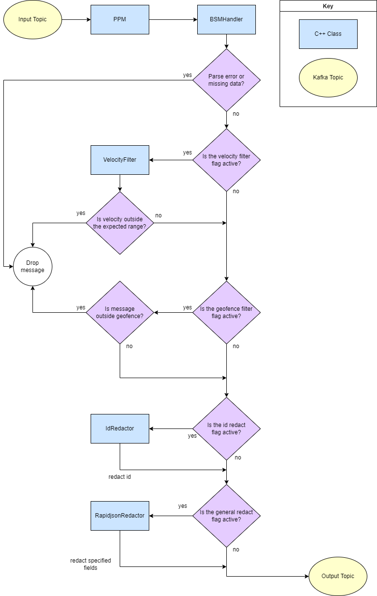

# Data Flow Diagram
The purpose of this diagram is to show how data flows through the Privacy Protection Module.

## Key Explanation
- The blue rectangles are C++ classes that belong to this repository.
- The yellow ovals are kafka topics that the PPM consumes from and produces to.

## Data Flow Explanation
1. The PPM pulls from the Input Topic and passes the message to the BSMHandler class.
1. Throughout the flow, if the BSMHandler encounters a parse error or missing data, the message will be dropped.
1. If the velocity filter flag is active, the message will be passed to the VelocityFilter class.
1. If the velocity is outside the expected range, the message will be dropped.
1. If the geofence filter flag is active and the message is outside the geofence, it will be dropped.
1. If the id redact flag is active, the message will be passed to the IdRedactor class.
1. The IdRedactor class will redact the id if it is found.
1. If the general redact flag is active, the message will be passed to the RapidjsonRedactor class.
1. The RapidjsonRedactor class will redact specified fields from the message if they are found.
1. The PPM pushes the message to the Output topic.